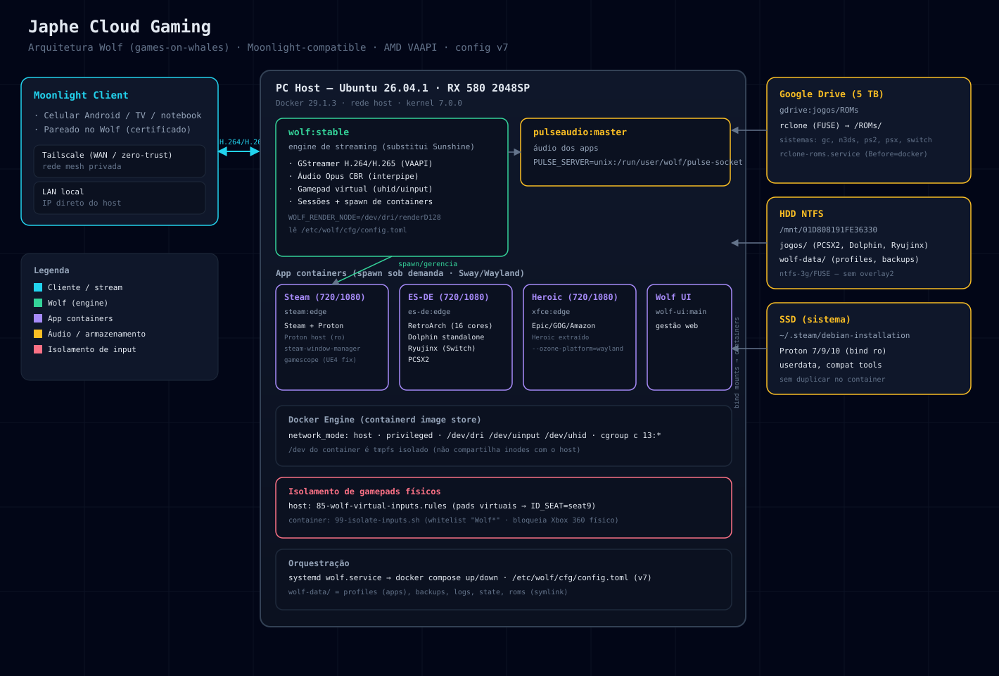

# 🐺 Wolf Cloud Gaming — Self-Hosted Cloud Gaming Stack

[](https://www.docker.com/)
[](https://wayland.freedesktop.org/)
[](https://gstreamer.freedesktop.org/)
[](https://moonlight-stream.org/)
[](https://github.com/)

Servidor de **cloud gaming de baixa latência e alta performance** self-hosted baseado em [Wolf (games-on-whales)](https://github.com/games-on-whales/wolf), projetado para substituir soluções baseadas em captura direta de desktop (como Sunshine) ao entregar jogos de PC (Steam/Proton, Heroic) e emuladores (RetroArch, Dolphin standalone, Ryujinx, PCSX2) via protocolo **Moonlight** em **containers Docker Wayland/Sway totalmente isolados**.

---

## 📑 Sumário

- [Visão Geral e Benefícios](#-visão-geral-e-benefícios)
- [Arquitetura do Sistema](#-arquitetura-do-sistema)
- [Metodologia de Desenvolvimento (AI Multi-Agent & Vibecoding)](#-metodologia-de-desenvolvimento-ai-multi-agent--vibecoding)
- [Hardware e Ambiente de Referência](#-hardware-e-ambiente-de-referência)
- [Estrutura do Repositório](#-estrutura-do-repositório)
- [Aplicações Disponíveis](#-aplicações-disponíveis)
- [Sistemas e Emuladores Suportados](#-sistemas-e-emuladores-suportados)
- [Componentes Customizados e Daemons](#-componentes-customizados-e-daemons)
- [Guia de Instalação e Setup Passo a Passo](#-guia-de-instalação-e-setup-passo-a-passo)
- [Operação e Diagnóstico](#-operação-e-diagnóstico)
- [Hotkeys e Controles](#-hotkeys-e-controles)
- [Engenharia de Baixo Nível & Pitfalls Conhecidos](#-engenharia-de-baixo-nível--pitfalls-conhecidos)
- [Referências](#-referências)

---

## 🌟 Visão Geral e Benefícios

Diferente de ferramentas tradicionais de streaming que apenas espelham a tela física do sistema operacional (travando o uso do computador), esta stack cria **sessões virtuais Wayland sob demanda**:

- 🔒 **Isolamento Completo por Container:** Cada jogo ou emulador roda em seu próprio container isolado com compositor Sway/Wayland dedicado.
- 👥 **Multi-Seat Real:** O computador host continua livre e utilizável para trabalho ou navegação enquanto outra pessoa joga remotamente.
- ⚡ **Aceleração por Hardware em Tempo Real:** Captura direta e codificação de vídeo de baixíssima latência com GStreamer e encoders de hardware (**AMD VAAPI** / NVENC / QSV).
- 🎮 **Navegação 100% por Controle (Controller-Friendly):** Frontend integrado com ES-DE (EmulationStation) e Steam Big Picture.
- 🌐 **Acesso Remoto Seguro:** Conexão externa sem necessidade de abrir portas no roteador via rede mesh **Tailscale**.

---

## 🏗️ Arquitetura do Sistema

```
┌───────────────────────────────────────────────────────────────────────────┐
│                           Host Linux (Ubuntu / Debian)                    │
│                                                                           │
│   Dispositivos Clientes ──►  Wolf Core (:stable)   ──►  App Containers     │
│   (Moonlight em TV/Cel)      (GStreamer + VAAPI)        (Docker Isolado)  │
│                                      │                    ├── Sway/Wayland│
│                                      │                    ├── ES-DE       │
│                                      ▼                    ├── RetroArch   │
│                             PulseAudio Server             ├── Steam/Proton│
│                             (Container Dedicado)          └── Dolphin...  │
│                                                                           │
│   Acesso Externo: Moonlight ──► Rede Mesh Privada (Tailscale)             │
│   Storage de ROMs: Cloud Storage (Google Drive) ──► rclone FUSE ──► /ROMs │
└───────────────────────────────────────────────────────────────────────────┘
```



### Fluxo de Execução de uma Sessão:
1. O cliente Moonlight conecta-se ao Wolf (via IP local ou IP privado Tailscale).
2. O Wolf negocia o codec de vídeo (`H.264`, `HEVC/H.265` ou `AV1`) via VAAPI na GPU e emite um gamepad virtual no kernel (`Wolf X-Box One (virtual) pad`).
3. O usuário seleciona o aplicativo no menu do Moonlight.
4. O Wolf inicializa o container Docker correspondente, montando apenas os diretórios e dispositivos necessários.
5. Áudio e vídeo são capturados em memória compartilhada e transmitidos via RTP para o cliente em tempo real.

---

## 🤖 Metodologia de Desenvolvimento (AI Multi-Agent & Vibecoding)

Este projeto foi construído, otimizado e documentado utilizando técnicas avançadas de **Vibecoding e Orquestração Multi-Agente de Inteligência Artificial**:

- **Google Antigravity (Gemini):** Utilizado para planejamento arquitetural, depuração profunda de logs do GStreamer, parametrização de containers e engenharia de documentação viva.
- **Hermes AI Platform:** Utilizado na análise contínua de memória técnica, criação de daemons Python para interceptação de janelas e scripts de controle de inputs do kernel Linux.

---

## 💻 Hardware e Ambiente de Referência

| Componente | Especificação de Teste / Referência |
|---|---|
| **Sistema Operacional** | Ubuntu 24.04 / 26.04 LTS (Kernel Linux 6.x+) |
| **GPU** | AMD Radeon RX 580 2048SP (Polaris 20 XL) — Driver Mesa VAAPI |
| **Memória** | 16 GB RAM |
| **Docker Engine** | Docker 24.0+ com suporte a cgroups v2 |
| **Storage** | SSD NVMe (Sistema + Proton) + Storage Secundário (Jogos/ROMs) |

> ℹ️ **Nota de Compatibilidade de GPU:** Embora configurado prioritariamente para **AMD VAAPI**, o arquivo de configuração inclui pipelines prontos para **NVIDIA NVENC** (`nvcodec`) e **Intel QuickSync** (`qsv`).

---

## 📂 Estrutura do Repositório

```
wolf-cloud-gaming/
├── .env.example                       # Template de variáveis de ambiente do host
├── config.example.toml                # Template da configuração central do Wolf (v7)
├── docker-compose.yml                 # Definição do serviço principal do Wolf
├── wolf.service                       # Arquivo de serviço systemd para inicialização automática
├── architecture.svg                   # Diagrama visual de arquitetura
├── profiles/
│   └── default/                       # Dados e customizações montados nos containers
│       ├── bin/                       # Daemons e scripts customizados
│       │   ├── dolphin-standalone/    # Wrapper e isolamento do Dolphin Standalone
│       │   ├── steam-window-manager/  # Daemon de foco automático de janelas Steam no Sway
│       │   ├── heroic-startup.sh      # Launcher do Heroic Games Launcher em Wayland
│       │   ├── heroic-init.d/         # Regras de udev para joysticks
│       │   ├── ryujinx* / eden        # Wrappers e runners para Nintendo Switch
│       │   └── wait-for-controller.sh # Sincronizador de inicialização de controle virtual
│       ├── es-de-config/              # Configurações do EmulationStation (custom systems)
│       ├── retroarch-config/          # Configurações do RetroArch
│       ├── pcsx2-config/              # Configurações do PCSX2
│       ├── waybar-config/             # Configurações da barra de status Sway
│       └── icons/                     # Ícones das aplicações no Moonlight
```

---

## 🎮 Aplicações Disponíveis

Cada aplicação possui variantes otimizadas em **720p** (alta taxa de quadros e menor latência) e **1080p** (fidelidade visual):

| Aplicação | Imagem Base | Modo de Execução | Destaque Técnico |
|---|---|---|---|
| **Wolf UI** | `wolf-ui:main` | Docker | Interface web administrativa |
| **Test ball** | — | Processo Nativo | Teste de latência de streaming e áudio |
| **Steam (720p / 1080p)** | `steam:edge` | Docker (Sway) | Proton montado em modo Read-Only do host sem duplicação de dados |
| **EmulationStation** | `es-de:edge` | Docker (Sway) | Frontend completo com RetroArch e emuladores standalone |
| **Heroic Games** | `xfce:edge` | Docker (Wayland) | Epic Games, GOG e Amazon Games rodando nativamente em Wayland |

---

## 🕹️ Sistemas e Emuladores Suportados

### 1. RetroArch (Cores Libretro Integrados)
- **Nintendo:** NES (`fceumm`), SNES (`snes9x`), N64 (`mupen64plus`), Game Boy/Color (`gambatte`), GBA (`mgba`), Nintendo DS (`melonds`), Nintendo 3DS (`azahar`).
- **Sega:** Mega Drive / Genesis (`genesis_plus_gx`), 32X (`picodrive`), Dreamcast (`flycast`).
- **Sony:** PlayStation 1 (`mednafen_psx`, `swanstation`), PSP (`ppsspp`), PlayStation 2 (`pcsx2`).
- **Outros:** Atari 2600 (`stella`).

### 2. Emuladores Standalone Customizados
- **GameCube (Dolphin Standalone):** Executado em modo standalone para permitir códigos Gecko/ActionReplay (hacks de tela widescreen 16:9 que o core libretro não suporta).
- **Nintendo Switch (Ryujinx):** Executado via wrapper isolado para tratamento correto de parâmetros de launch.
- **PlayStation 2 (PCSX2):** Configurado com bind-mount de texturas HD e cheats.

---

## ⚙️ Componentes Customizados e Daemons

Para superar limitações inerentes à execução de jogos em containers gráficos sem desktop tradicional, foram desenvolvidos componentes customizados:

### 1. Steam Window Manager (`bin/steam-window-manager/`)
Daemon em Python que escuta a árvore IPC do **Sway**. Garante que janelas de jogos iniciadas pelo Proton (`wine`, `gamescope`, `steam_app_*`) recebam foco imediato, eliminando telas pretas ou janelas presas em background.

### 2. Dolphin Standalone Launcher & Input Isolator (`bin/dolphin-standalone/`)
- **`run-dolphin.sh`**: Sobe um servidor **Xwayland dedicado (:5)** e envia sinal `SIGSTOP` para congelar o processo do EmulationStation durante o jogo, evitando o problema de *double-input* (onde o controle comanda o jogo e a interface do ES-DE simultaneamente). Ao encerrar o emulador, envia `SIGCONT` para restaurar o frontend.
- **`99-isolate-inputs.sh`**: Script que faz whitelist apenas do controle virtual do Wolf (`Wolf X-Box One pad`) e bloqueia joysticks físicos do host dentro do container.

### 3. Heroic Launcher em Wayland (`bin/heroic-*`)
Permite executar o cliente Electron do Heroic diretamente sobre o compositor Wayland sem dependência de X11 legado (`--ozone-platform=wayland`).

---

## 🚀 Guia de Instalação e Setup Passo a Passo

### 1. Pré-requisitos de Kernel e Módulos
Habilite o módulo `uhid` (necessário para que o Wolf emule gamepads virtuais no kernel) e configure permissões no FUSE:

```bash
# Carregar módulo uhid
echo "uhid" | sudo tee /etc/modules-load.d/uhid.conf
sudo modprobe uhid uinput

# Permitir montagens FUSE no Docker
echo "user_allow_other" | sudo tee -a /etc/fuse.conf
```

### 2. Drivers de Vídeo e Docker
```bash
# Instalar Docker
curl -fsSL https://get.docker.com | sudo sh
sudo usermod -aG docker $USER

# Instalar drivers VAAPI para GPU AMD (ou drivers proprietários NVIDIA se aplicável)
sudo apt install -y mesa-va-drivers gstreamer1.0-vaapi
```

### 3. Clonar o Repositório e Configurar Variáveis
```bash
git clone https://github.com/seu-usuario/wolf-cloud-gaming.git
cd wolf-cloud-gaming

# Configurar variáveis de ambiente locais
cp .env.example .env
nano .env

# Criar a configuração ativa do Wolf a partir do exemplo
sudo mkdir -p /etc/wolf/cfg
cp config.example.toml /etc/wolf/cfg/config.toml
```

### 4. Baixar Imagens Docker
```bash
docker compose pull
```

### 5. Iniciar o Servidor
Você pode rodar diretamente via Docker Compose ou configurar o serviço systemd:

```bash
# Execução direta via Compose
docker compose up -d

# OU instalar como serviço de sistema:
sudo cp wolf.service /etc/systemd/system/
sudo systemctl daemon-reload
sudo systemctl enable --now wolf
```

### 6. Pareamento com Moonlight
1. No seu dispositivo cliente (TV, celular, PC), abra o aplicativo **Moonlight**.
2. Adicione o IP do seu servidor (IP local ou IP do Tailscale).
3. Insira o PIN de pareamento exibido no Moonlight na interface web ou logs do Wolf:
   ```bash
   docker logs wolf
   ```
4. Após o pareamento, os jogos e emuladores estarão prontos para streaming!

---

## 🛠️ Operação e Diagnóstico

```bash
# Verificar status dos containers
docker ps

# Acompanhar logs do servidor em tempo real
docker logs -f wolf

# Reiniciar o serviço
sudo systemctl restart wolf

# Verificar se a GPU está sendo utilizada pelo encoder VAAPI
docker logs wolf 2>&1 | grep -E "Using.*encoder|Creating Xbox"
```

---

## 🎮 Hotkeys e Controles

Para emuladores standalone como o Dolphin que rodam sem interface gráfica (`nogui`), as seguintes combinações de botões no controle disparam ações nativas:

| Combinação no Controle | Ação Executada |
|---|---|
| **Guide (Xbox/Home) + Start** | Encerrar jogo e retornar ao menu do ES-DE |
| **Guide + Y** | Pausar / Despausar jogo |
| **Guide + X** | Capturar Screenshot |
| **Guide + LB** | Carregar Savestate (Slot 1) |
| **Guide + RB** | Salvar Savestate (Slot 1) |

---

## 🧠 Engenharia de Baixo Nível & Pitfalls Conhecidos

Esta seção documenta desafios técnicos avançados resolvidos durante a construção desta infraestrutura:

1. **Double-Input em Emuladores Xwayland:**
   * *Causa:* Emuladores lendo eventos diretamente do `/dev/input/event*` em paralelo com a interface do EmulationStation.
   * *Solução:* Pausar o processo pai com sinal POSIX `SIGSTOP` durante o gameplay e enviar `SIGCONT` no término.
2. **Isolamento de Seats de Dispositivos (`seat9`):**
   * *Causa:* Dispositivos virtuais criados pelo Wolf sendo detectados pelo desktop do host.
   * *Solução:* Regra `udev` atribuindo `ID_SEAT=seat9` aos dispositivos virtuais, isolando-os do `seat0` (desktop físico).
3. **Bloqueio de Swapchain em Jogos Unreal Engine / Proton:**
   * *Causa:* Jogos travando em modo fullscreen exclusivo quando a resolução do display virtual difere da janela.
   * *Solução:* Execução intermediada via `gamescope` (`gamescope -w 1280 -h 720 -r 60 -f -- %command%`).
4. **Armazenamento Docker sobre NTFS:**
   * *Causa:* O driver `overlay2` do Docker requer chamadas de sistema POSIX como `renameat2`, incompatíveis com partições NTFS montadas via FUSE.
   * *Solução:* Manter o `data-root` do Docker no filesystem raiz (ext4) e usar bind mounts específicos apenas para as pastas de jogos.

---

## 📚 Referências

- [Wolf Project (Games on Whales)](https://github.com/games-on-whales/wolf)
- [Moonlight Game Streaming](https://moonlight-stream.org/)
- [EmulationStation Desktop Edition (ES-DE)](https://es-de.org/)
- [RetroArch Libretro](https://www.retroarch.com/)
- [Tailscale Zero Trust Networking](https://tailscale.com/)

---

<div align="center">
  <sub>Construído e mantido com paixão por Japhe · Desenvolvido com auxílio de IA (Hermes & Google Antigravity)</sub>
</div>
